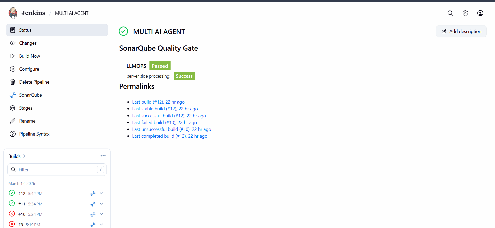
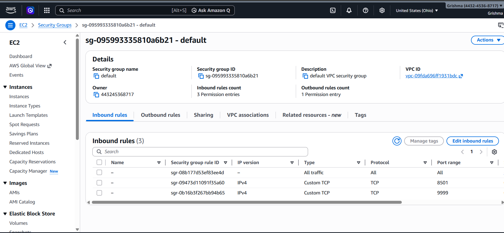
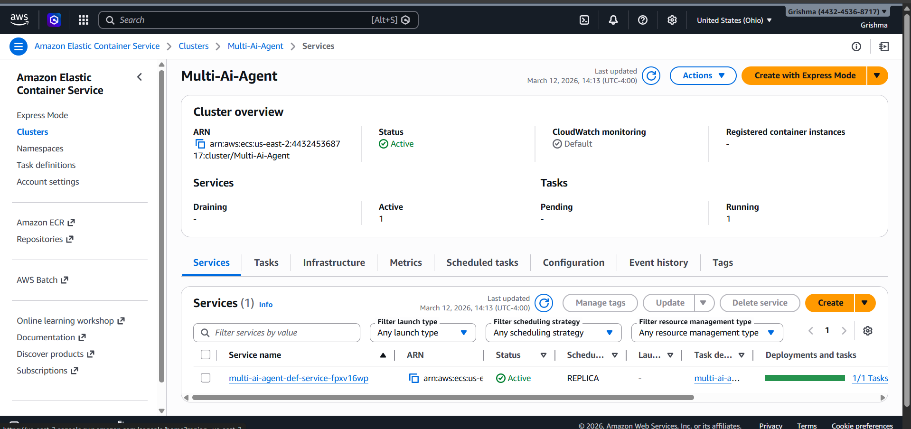
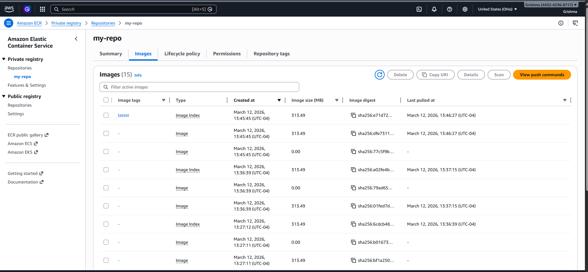

# Multi-AI Agent using Groq and Tavily

An end-to-end **LLM-powered Multi-AI Agent application** built from scratch using **Python** and **Streamlit**, with a complete **CI/CD and cloud deployment pipeline** using **GitHub, Jenkins, SonarQube, Docker, AWS ECR, and AWS ECS**.

This project allows users to define an AI agent role, select an LLM model, optionally enable web search, and ask queries through an interactive web interface.

---

## Project Overview

The **Multi-AI Agent** project is an AI-based application that enables users to interact with intelligent agents powered by large language models. The frontend is developed using **Streamlit**, while the backend integrates **Groq API** for LLM inference and **Tavily API** for web search capabilities.

In addition to AI functionality, this project demonstrates a complete **DevOps workflow**:

- Source code management with **GitHub**
- Automated pipeline execution with **Jenkins**
- Static code quality analysis with **SonarQube**
- Application containerization with **Docker**
- Image storage in **AWS ECR**
- Container deployment on **AWS ECS**

---

## Features

- Create a custom AI agent by defining its role
- Select from multiple LLM models
- Enable or disable web search
- Ask natural language queries through a simple UI
- Integrate real-time web results using Tavily
- Automate build and deployment using Jenkins CI/CD
- Analyze code quality using SonarQube
- Deploy containerized app on AWS ECS

---

## Tech Stack

### Programming & Frontend
- Python
- Streamlit

### AI / LLM Integration
- Groq API
- Tavily API
- Prompt-based AI Agent workflow

### DevOps & Cloud
- GitHub
- Jenkins
- SonarQube
- Docker
- AWS ECR
- AWS ECS

---

## CI/CD Workflow

The project follows this pipeline:

**GitHub → Jenkins → SonarQube → Docker Build → AWS ECR → AWS ECS → Live Streamlit App**

### Pipeline Steps
1. Code is pushed to GitHub
2. Jenkins pulls the latest source code
3. SonarQube performs static code quality analysis
4. Docker builds the application image
5. The image is pushed to AWS ECR
6. AWS ECS runs the latest containerized version of the application

# 1. Jenkins Pipeline Success

This screenshot shows the Jenkins pipeline for the MULTI AI AGENT project.
The pipeline successfully passed the SonarQube Quality Gate, confirming that the project completed the automated quality check stage successfully.

Jenkins was used to automate the CI/CD workflow

The pipeline integrates code checkout, quality analysis, build, and deployment stages

This validates that the project was configured correctly inside Jenkins



2. SonarQube Code Quality Analysis

This screenshot shows the SonarQube dashboard for the project LLMOPS.
The project passed the Quality Gate, with no open issues in security and reliability, and maintainability rated positively.

SonarQube was integrated into the Jenkins pipeline

It was used for static code analysis

The screenshot shows the project overview, issue summary, and code quality status


3. AWS Security Group Configuration

This screenshot shows the AWS EC2 Security Group inbound rules used for the deployed application.

Important ports opened:

8501 → Streamlit application access

9999 → Additional custom TCP access used during deployment/testing

This step was required so the deployed application could be accessed externally through the public IP.




4. AWS ECS Cluster and Running Service

This screenshot shows the AWS ECS Cluster named Multi-Ai-Agent with an active running service.

The ECS cluster is active

One service is deployed

One task is running successfully

This confirms that the containerized application was deployed and managed using AWS ECS.




5. AWS ECR Repository and Docker Images

This screenshot shows the AWS Elastic Container Registry (ECR) repository my-repo.

Docker images built through Jenkins were pushed to ECR

The latest image tag is visible

This repository acts as the container registry for deployment to ECS

This demonstrates the integration between Docker, Jenkins, and AWS ECR.




Live Application

The deployed application provides a Streamlit interface where the user can:

Define the AI agent role

Select the LLM model

Enable web search

Enter a query

Receive AI-generated responses

Example use case:

Define the agent as a financial advisor

Choose an LLM model such as llama-3.3-70b-versatile

Ask a question like: Suggest me some good stocks right now

Demo Video :- 


Key Learning Outcomes

Through this project, I gained hands-on experience in:

Building an AI-powered application from scratch

Developing interactive frontends with Streamlit

Integrating LLM APIs and search APIs

Setting up CI/CD pipelines using Jenkins

Running static code analysis with SonarQube

Containerizing applications using Docker

Deploying applications on AWS ECS

Managing container images with AWS ECR

Configuring cloud networking and security access


---

## Project Architecture

```text
User
  |
  v
Streamlit Frontend
  |
  v
Multi-AI Agent Logic
  |
  +--> Groq API (LLM response generation)
  |
  +--> Tavily API (web search)
  |
  v
Jenkins CI/CD Pipeline
  |
  +--> SonarQube Quality Analysis
  +--> Docker Image Build
  +--> AWS ECR Image Push
  +--> AWS ECS Deployment

